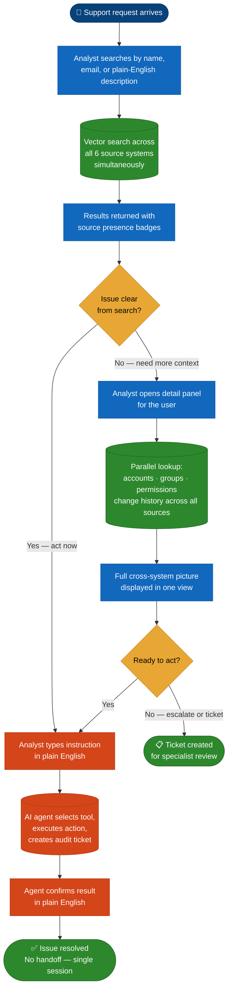

# Analyst Workflow

End-to-end flow from a support request arriving to resolution, without a team handoff.

```mermaid
flowchart TD
    classDef analyst fill:#08427B,stroke:#073B6F,color:#fff
    classDef app fill:#1168BD,stroke:#0E5BA7,color:#fff
    classDef db fill:#2D882D,stroke:#226622,color:#fff
    classDef agent fill:#D4451A,stroke:#B83A15,color:#fff
    classDef outcome fill:#2D882D,stroke:#226622,color:#fff
    classDef decision fill:#E8A735,stroke:#C48E2C,color:#000

    A(["👤 Support request arrives"]):::analyst
    B["Analyst searches by name,\nemail, or plain-English description"]:::app
    C[("Vector search across\nall 6 source systems\nsimultaneously")]:::db
    D["Results returned with\nsource presence badges"]:::app
    E{"Issue clear\nfrom search?"}:::decision

    F["Analyst opens detail panel\nfor the user"]:::app
    G[("Parallel lookup:\naccounts · groups · permissions\nchange history across all sources")]:::db
    H["Full cross-system picture\ndisplayed in one view"]:::app
    I{"Ready to act?"}:::decision

    J["Analyst types instruction\nin plain English"]:::agent
    K[("AI agent selects tool,\nexecutes action,\ncreates audit ticket")]:::agent
    L["Agent confirms result\nin plain English"]:::agent

    M(["✅ Issue resolved\nNo handoff — single session"]):::outcome

    A --> B --> C --> D --> E
    E -->|"Yes — act now"| J
    E -->|"No — need more context"| F
    F --> G --> H --> I
    I -->|"Yes"| J
    I -->|"No — escalate or ticket"| N
    J --> K --> L --> M

    N(["📋 Ticket created\nfor specialist review"]):::outcome
```
