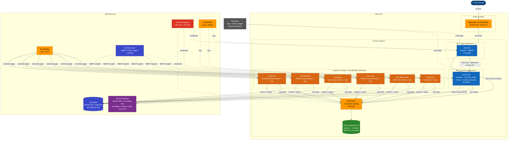

```mermaid
flowchart TB
    classDef person fill:#08427B,stroke:#073B6F,color:#fff
    classDef aws fill:#FF9900,stroke:#CC7A00,color:#000
    classDef lambda fill:#D86613,stroke:#B8520F,color:#fff
    classDef eks fill:#1168BD,stroke:#0E5BA7,color:#fff
    classDef rds fill:#2D882D,stroke:#226622,color:#fff
    classDef storage fill:#3B48CC,stroke:#2F3AA3,color:#fff
    classDef security fill:#DD3522,stroke:#B72B1C,color:#fff
    classDef bedrock fill:#7B2D8E,stroke:#5E2270,color:#fff
    classDef external fill:#555555,stroke:#333333,color:#fff

    User([IT Administrator]):::person

    subgraph VPC[AWS VPC]
        direction TB

        subgraph Public[Public Subnets]
            ALB["Application Load Balancer\nHTTPS:443 - ACM cert"]:::aws
        end

        subgraph Private[Private Subnets]
            subgraph AppSvc[EKS - App Deployment]
                App["App Pod\nExpress + SBERT\nPort 3000"]:::eks
            end

            subgraph GenAISvc[EKS - GenAI Deployment]
                GenAI["GenAI Pod\nExpress - LLM tool-calling\n9 tools - 6 action executors\nPort 3001"]:::eks
            end

            subgraph LambdaFns[Lambda Functions - EventBridge Scheduled]
                L_AD["etl-ad-line\nAD primary + logs"]:::lambda
                L_NF["etl-netforum-line\nnetForum primary + logs"]:::lambda
                L_EU["etl-eu-line\nExternal Users primary + logs"]:::lambda
                L_DG["etl-dg-line\nDist Groups primary + logs"]:::lambda
                L_M365["etl-m365-line\nM365 Groups primary + logs"]:::lambda
                L_SP["etl-sp-line\nSharePoint permissions + logs"]:::lambda
            end

            RDSProxy["RDS Proxy\nConnection pooling\nIAM auth"]:::aws
            RDS[("RDS PostgreSQL 18\npgvector - 15 tables\nMulti-AZ, encrypted")]:::rds
        end
    end

    subgraph AWSServices[AWS Services]
        Bedrock["Amazon Bedrock\n(Model TBD - tool-calling API)\nCandidate: Claude 3 Haiku / Nova Pro"]:::bedrock
        S3[("S3 Bucket\nprimary.json + logs.json\nper data line (x6)")]:::storage
        EB["EventBridge\nrate: 1 hour"]:::aws
        SM["Secrets Manager\nDB creds - API keys"]:::security
        LambdaLayer["Lambda Layer\nSBERT model weights (~80 MB)"]:::storage
        CW["CloudWatch\nLogs + Alarms"]:::aws
    end

    Artifactory["Artifactory\nApp + GenAI images\n(external registry)"]:::external

    User -->|HTTPS| ALB
    ALB -->|port 3000| App
    App -->|K8s DNS - agent and tickets API| GenAI
    App -->|SQL cosine similarity| RDSProxy
    GenAI -->|tool-calling| Bedrock
    GenAI -->|agent_tickets CRUD| RDSProxy
    RDSProxy --> RDS

    EB -->|schedule trigger| L_AD
    EB -->|schedule trigger| L_NF
    EB -->|schedule trigger| L_EU
    EB -->|schedule trigger| L_DG
    EB -->|schedule trigger| L_M365
    EB -->|schedule trigger| L_SP

    L_AD -->|read data| S3
    L_NF -->|read data| S3
    L_EU -->|read data| S3
    L_DG -->|read data| S3
    L_M365 -->|read data| S3
    L_SP -->|read data| S3

    L_AD -->|embed + upsert| RDSProxy
    L_NF -->|embed + upsert| RDSProxy
    L_EU -->|embed + upsert| RDSProxy
    L_DG -->|embed + upsert| RDSProxy
    L_M365 -->|embed + upsert| RDSProxy
    L_SP -->|embed + upsert| RDSProxy

    LambdaLayer -.->|SBERT weights| L_AD
    LambdaLayer -.->|SBERT weights| L_NF
    LambdaLayer -.->|SBERT weights| L_EU
    LambdaLayer -.->|SBERT weights| L_DG
    LambdaLayer -.->|SBERT weights| L_M365
    LambdaLayer -.->|SBERT weights| L_SP

    SM -.->|credentials| App
    SM -.->|credentials| GenAI
    SM -.->|credentials| RDSProxy

    Artifactory -.->|pull image| App
    Artifactory -.->|pull image| GenAI
    CW -.->|logs| App
    CW -.->|logs| GenAI
    CW -.->|logs| L_AD
```
