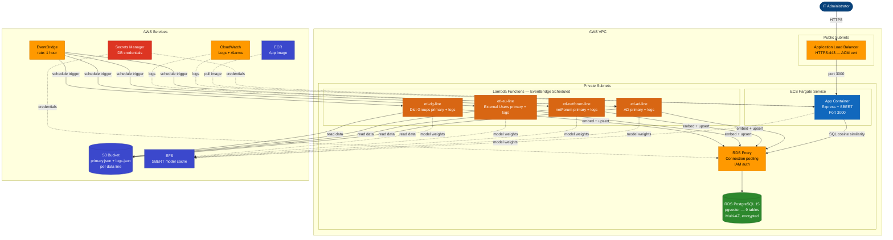

```mermaid
flowchart TB
    classDef person fill:#08427B,stroke:#073B6F,color:#fff
    classDef aws fill:#FF9900,stroke:#CC7A00,color:#000
    classDef lambda fill:#D86613,stroke:#B8520F,color:#fff
    classDef fargate fill:#1168BD,stroke:#0E5BA7,color:#fff
    classDef rds fill:#2D882D,stroke:#226622,color:#fff
    classDef storage fill:#3B48CC,stroke:#2F3AA3,color:#fff
    classDef security fill:#DD3522,stroke:#B72B1C,color:#fff

    User([IT Administrator]):::person

    subgraph VPC ["AWS VPC"]
        direction TB

        subgraph Public ["Public Subnets"]
            ALB["Application Load Balancer\nHTTPS:443 — ACM cert"]:::aws
        end

        subgraph Private ["Private Subnets"]
            subgraph FargateSvc ["ECS Fargate Service"]
                App["App Container\nExpress + SBERT\nPort 3000"]:::fargate
            end

            subgraph LambdaFns ["Lambda Functions — EventBridge Scheduled"]
                L_AD["etl-ad-line\nAD primary + logs"]:::lambda
                L_NF["etl-netforum-line\nnetForum primary + logs"]:::lambda
                L_EU["etl-eu-line\nExternal Users primary + logs"]:::lambda
                L_DG["etl-dg-line\nDist Groups primary + logs"]:::lambda
            end

            RDSProxy["RDS Proxy\nConnection pooling\nIAM auth"]:::aws
            RDS[("RDS PostgreSQL 15\npgvector — 9 tables\nMulti-AZ, encrypted")]:::rds
        end
    end

    subgraph External ["AWS Services"]
        S3[("S3 Bucket\nprimary.json + logs.json\nper data line")]:::storage
        EB["EventBridge\nrate: 1 hour"]:::aws
        SM["Secrets Manager\nDB credentials"]:::security
        ECR["ECR\nApp image"]:::storage
        EFS["EFS\nSBERT model cache"]:::storage
        CW["CloudWatch\nLogs + Alarms"]:::aws
    end

    User -->|HTTPS| ALB
    ALB -->|port 3000| App
    App -->|SQL cosine similarity| RDSProxy
    RDSProxy --> RDS

    EB -->|schedule trigger| L_AD
    EB -->|schedule trigger| L_NF
    EB -->|schedule trigger| L_EU
    EB -->|schedule trigger| L_DG

    L_AD -->|read data| S3
    L_NF -->|read data| S3
    L_EU -->|read data| S3
    L_DG -->|read data| S3

    L_AD -->|embed + upsert| RDSProxy
    L_NF -->|embed + upsert| RDSProxy
    L_EU -->|embed + upsert| RDSProxy
    L_DG -->|embed + upsert| RDSProxy

    App -.->|model weights| EFS
    L_AD -.->|model weights| EFS
    L_NF -.->|model weights| EFS
    L_EU -.->|model weights| EFS
    L_DG -.->|model weights| EFS

    SM -.->|credentials| App
    SM -.->|credentials| RDSProxy

    ECR -.->|pull image| App
    CW -.->|logs| App
    CW -.->|logs| L_AD
```
