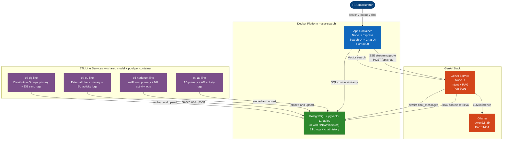

```mermaid
flowchart TB
    classDef person fill:#08427B,stroke:#073B6F,color:#fff
    classDef container fill:#1168BD,stroke:#0E5BA7,color:#fff
    classDef database fill:#2D882D,stroke:#226622,color:#fff
    classDef etl fill:#7B4F8A,stroke:#6A3D7A,color:#fff
    classDef genai fill:#D4451A,stroke:#B83A15,color:#fff

    User(["IT Administrator"]):::person

    subgraph ETL["ETL Line Services — shared model + pool per container"]
        ETL_AD["etl-ad-line\nAD primary + AD activity logs"]:::etl
        ETL_NF["etl-netforum-line\nnetForum primary + NF activity logs"]:::etl
        ETL_EU["etl-eu-line\nExternal Users primary + EU activity logs"]:::etl
        ETL_DG["etl-dg-line\nDistribution Groups primary + DG sync logs"]:::etl
    end

    subgraph GenAIStack["GenAI Stack"]
        Ollama["Ollama\nqwen2.5:3b\nPort 11434"]:::genai
        GenAI["GenAI Service\nNode.js\nIntent + RAG\nPort 3001"]:::genai
    end

    subgraph Platform["Docker Platform - user-search"]
        App["App Container\nNode.js Express\nSearch UI + Chat UI\nPort 3000"]:::container
        Postgres["PostgreSQL + pgvector\n11 tables\n(8 with HNSW indexes)\nETL logs + chat history"]:::database
    end

    User -->|"search / lookup / chat"| App
    App -->|"SQL cosine similarity"| Postgres
    App -->|"SSE streaming proxy\nPOST /api/chat"| GenAI
    GenAI -->|"RAG context retrieval"| Postgres
    GenAI -->|"Vector search"| App
    GenAI -->|"LLM inference"| Ollama
    GenAI -->|"persist chat_messages"| Postgres

    ETL_AD -->|"embed and upsert"| Postgres
    ETL_NF -->|"embed and upsert"| Postgres
    ETL_EU -->|"embed and upsert"| Postgres
    ETL_DG -->|"embed and upsert"| Postgres
```
