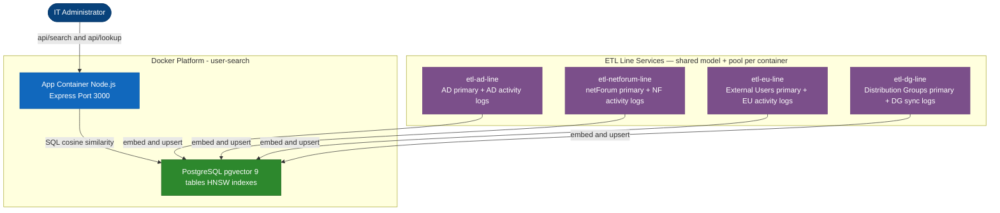

```mermaid
flowchart TB
    classDef person fill:#08427B,stroke:#073B6F,color:#fff
    classDef container fill:#1168BD,stroke:#0E5BA7,color:#fff
    classDef database fill:#2D882D,stroke:#226622,color:#fff
    classDef etl fill:#7B4F8A,stroke:#6A3D7A,color:#fff

    User([IT Administrator]):::person

    subgraph ETL["ETL Line Services — shared model + pool per container"]
        ETL_AD["etl-ad-line\nAD primary + AD activity logs"]:::etl
        ETL_NF["etl-netforum-line\nnetForum primary + NF activity logs"]:::etl
        ETL_EU["etl-eu-line\nExternal Users primary + EU activity logs"]:::etl
        ETL_DG["etl-dg-line\nDistribution Groups primary + DG sync logs"]:::etl
    end

    subgraph Platform["Docker Platform - user-search"]
        App["App Container Node.js Express Port 3000"]:::container
        Postgres["PostgreSQL pgvector 9 tables HNSW indexes"]:::database
    end

    User -->|"api/search and api/lookup"| App
    App -->|"SQL cosine similarity"| Postgres

    ETL_AD -->|"embed and upsert"| Postgres
    ETL_NF -->|"embed and upsert"| Postgres
    ETL_EU -->|"embed and upsert"| Postgres
    ETL_DG -->|"embed and upsert"| Postgres
```
