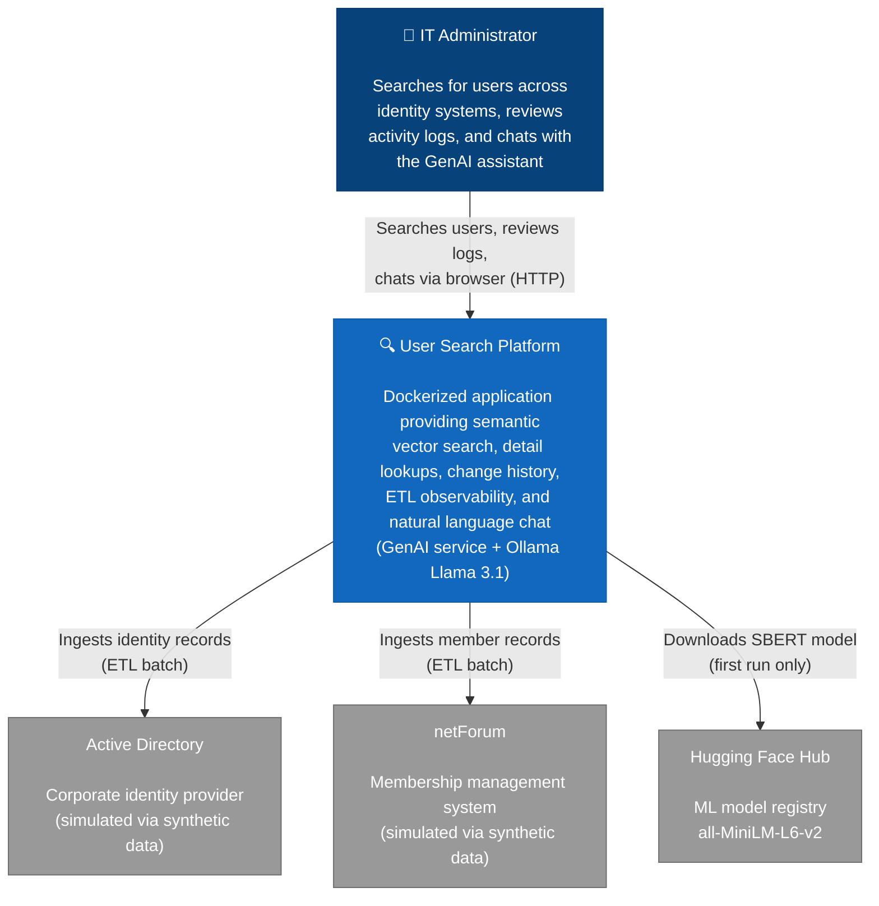

# C4 System Context Diagram

```mermaid
graph TB
    classDef person fill:#08427B,stroke:#073B6F,color:#fff
    classDef system fill:#1168BD,stroke:#0E5BA7,color:#fff
    classDef external fill:#999999,stroke:#6B6B6B,color:#fff

    User["👤 IT Administrator<br/><br/>Searches for users across<br/>identity systems, reviews<br/>activity logs, and chats with<br/>the GenAI assistant"]:::person

    UserSearch["🔍 User Search Platform<br/><br/>Dockerized application providing semantic<br/>vector search, detail lookups, change history,<br/>ETL observability, and natural language chat<br/>(GenAI service + Ollama Llama 3.1)"]:::system

    AD["Active Directory<br/><br/>Corporate identity provider<br/>(simulated via synthetic data)"]:::external
    NF["netForum<br/><br/>Membership management system<br/>(simulated via synthetic data)"]:::external
    HF["Hugging Face Hub<br/><br/>ML model registry<br/>all-MiniLM-L6-v2"]:::external

    User -->|"Searches users, reviews logs,<br/>chats via browser (HTTP)"| UserSearch
    UserSearch -->|"Ingests identity records<br/>(ETL batch)"| AD
    UserSearch -->|"Ingests member records<br/>(ETL batch)"| NF
    UserSearch -->|"Downloads SBERT model<br/>(first run only)"| HF
```
