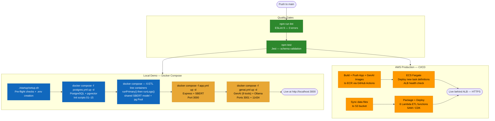

```mermaid
flowchart TD
    classDef cmd fill:#1168BD,stroke:#0E5BA7,color:#fff
    classDef check fill:#2D882D,stroke:#226622,color:#fff
    classDef deploy fill:#E8A735,stroke:#C48E2C,color:#000
    classDef aws fill:#FF9900,stroke:#CC7A00,color:#000

    START(["Push to main"]) --> LINT

    subgraph Quality [" Quality Gates "]
        LINT["npm run lint\nESLint 9 — 0 errors"]:::check
        TEST["npm test\nJest — schema validation"]:::check
        LINT --> TEST
    end

    TEST --> LOCAL
    TEST --> AWS

    subgraph LOCAL [" Local Demo — Docker Compose "]
        SETUP["./startup/setup.sh\nPre-flight checks + .env creation"]:::cmd
        PG["docker compose -f postgres.yml up -d\nPostgreSQL + pgvector\nInit scripts 01–15"]:::cmd
        LINE_ETL["docker compose — 6 ETL line containers\nrunPrimary() then runLogs()\nshared SBERT model + pg.Pool"]:::cmd
        APP_LOCAL["docker compose -f app.yml up -d\nExpress + SBERT\nPort 3000"]:::deploy
        GENAI_LOCAL["docker compose -f genai.yml up -d\nGenAI (9 tools) + Ollama\nPorts 3001 + 11434"]:::deploy
        SETUP --> PG --> LINE_ETL --> APP_LOCAL --> GENAI_LOCAL
        GENAI_LOCAL --> DONE_LOCAL(["Live at http://localhost:3000"])
    end

    subgraph AWS [" AWS Production — CI/CD "]
        ECR_PUSH["Build + Push App + GenAI Images\nto ECR via GitHub Actions"]:::aws
        FARGATE["ECS Fargate\nDeploy new task definitions\nALB health check"]:::aws
        LAMBDA["Package + Deploy\n6 Lambda ETL functions\nSAM / CDK"]:::aws
        S3_SYNC["Sync data files\nto S3 bucket"]:::aws

        ECR_PUSH --> FARGATE
        S3_SYNC --> LAMBDA
        FARGATE --> DONE_AWS(["Live behind ALB — HTTPS"])
        LAMBDA --> DONE_AWS
    end
```