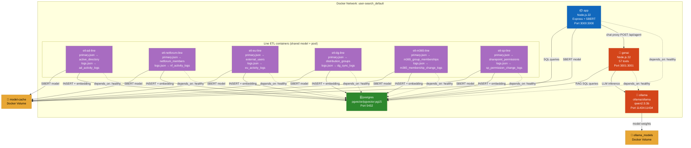

# Docker Compose Service Topology

```mermaid
flowchart TB
    classDef infra fill:#2D882D,stroke:#226622,color:#fff
    classDef app fill:#1168BD,stroke:#0E5BA7,color:#fff
    classDef etlLine fill:#A86CC1,stroke:#8B5BA3,color:#fff
    classDef genai fill:#D4451A,stroke:#B83A15,color:#fff
    classDef volume fill:#E8A735,stroke:#C48E2C,color:#000

    subgraph net ["Docker Network: user-search_default"]
        direction TB

        PG["🗄️ postgres\npgvector/pgvector:pg15\nPort 5432"]:::infra

        APP["📦 app\nNode.js 22\nExpress + SBERT\nPort 3000:3000"]:::app

        OLLAMA["🧠 ollama\nollama/ollama\nqwen2.5:3b\nPort 11434:11434"]:::genai

        GENAI["🤖 genai\nNode.js 22\n57 tools\nPort 3001:3001"]:::genai

        subgraph etl_lines ["Line ETL containers (shared model + pool)"]
            direction LR
            C1["etl-ad-line\nprimary.json → active_directory\nlogs.json → ad_activity_logs"]:::etlLine
            C2["etl-netforum-line\nprimary.json → netforum_members\nlogs.json → nf_activity_logs"]:::etlLine
            C3["etl-eu-line\nprimary.json → external_users\nlogs.json → eu_activity_logs"]:::etlLine
            C4["etl-dg-line\nprimary.json → distribution_groups\nlogs.json → dg_sync_logs"]:::etlLine
            C5["etl-m365-line\nprimary.json → m365_group_memberships\nlogs.json → m365_membership_change_logs"]:::etlLine
            C6["etl-sp-line\nprimary.json → sharepoint_permissions\nlogs.json → sp_permission_change_logs"]:::etlLine
        end
    end

    MC["📁 model-cache\nDocker Volume"]:::volume
    OM["📁 ollama_models\nDocker Volume"]:::volume

    C1 & C2 & C3 & C4 & C5 & C6 -->|"SBERT model"| MC
    C1 & C2 & C3 & C4 & C5 & C6 -->|"INSERT + embedding"| PG
    APP -->|"SQL queries"| PG
    APP -->|"SBERT model"| MC
    APP -->|"chat proxy POST /api/agent"| GENAI
    GENAI -->|"RAG SQL queries"| PG
    GENAI -->|"LLM inference"| OLLAMA
    OLLAMA -->|"model weights"| OM

    C1 & C2 & C3 & C4 & C5 & C6 -.->|"depends_on: healthy"| PG
    APP -.->|"depends_on: healthy"| PG
    GENAI -.->|"depends_on: healthy"| OLLAMA
```
