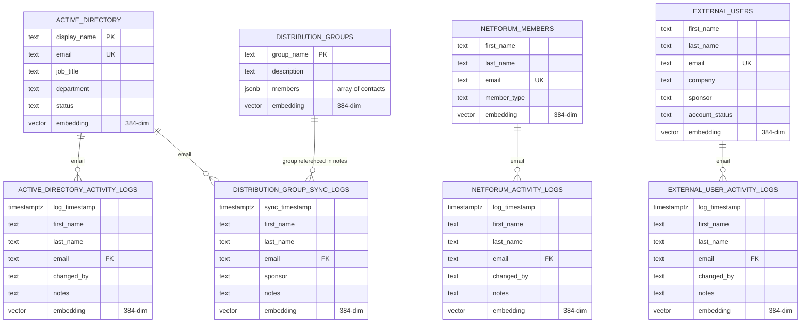

# Entity Relationship Diagram

```mermaid
erDiagram
    ACTIVE_DIRECTORY {
        text display_name PK
        text email UK
        text job_title
        text department
        text status
        vector embedding "384-dim"
    }

    NETFORUM_MEMBERS {
        text first_name
        text last_name
        text email UK
        text member_type
        vector embedding "384-dim"
    }

    EXTERNAL_USERS {
        text first_name
        text last_name
        text email UK
        text company
        text sponsor
        text account_status
        vector embedding "384-dim"
    }

    DISTRIBUTION_GROUPS {
        text group_name PK
        text description
        jsonb members "array of contacts"
        vector embedding "384-dim"
    }

    DISTRIBUTION_GROUP_SYNC_LOGS {
        timestamptz sync_timestamp
        text first_name
        text last_name
        text email FK
        text sponsor
        text notes
        vector embedding "384-dim"
    }

    ACTIVE_DIRECTORY_ACTIVITY_LOGS {
        timestamptz log_timestamp
        text first_name
        text last_name
        text email FK
        text changed_by
        text notes
        vector embedding "384-dim"
    }

    EXTERNAL_USER_ACTIVITY_LOGS {
        timestamptz log_timestamp
        text first_name
        text last_name
        text email FK
        text changed_by
        text notes
        vector embedding "384-dim"
    }

    NETFORUM_ACTIVITY_LOGS {
        timestamptz log_timestamp
        text first_name
        text last_name
        text email FK
        text changed_by
        text notes
        vector embedding "384-dim"
    }

    ACTIVE_DIRECTORY ||--o{ ACTIVE_DIRECTORY_ACTIVITY_LOGS : "email"
    ACTIVE_DIRECTORY ||--o{ DISTRIBUTION_GROUP_SYNC_LOGS : "email"
    NETFORUM_MEMBERS ||--o{ NETFORUM_ACTIVITY_LOGS : "email"
    EXTERNAL_USERS ||--o{ EXTERNAL_USER_ACTIVITY_LOGS : "email"
    DISTRIBUTION_GROUPS ||--o{ DISTRIBUTION_GROUP_SYNC_LOGS : "group referenced in notes"
```
