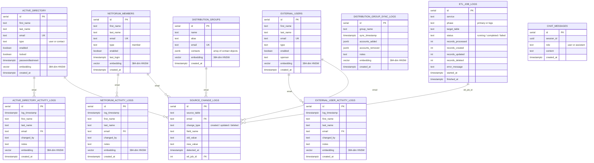

# Entity Relationship Diagram

11 tables total: 4 primary sources, 4 activity/sync log tables, 3 supporting tables (ETL logs, change logs, chat).

```mermaid
erDiagram
    ACTIVE_DIRECTORY {
        serial id PK
        text first_name
        text last_name
        text email UK
        text type "user or contact"
        boolean enabled
        boolean locked
        timestamptz passwordlastreset
        vector embedding "384-dim HNSW"
        timestamptz created_at
    }

    NETFORUM_MEMBERS {
        serial id PK
        text first_name
        text last_name
        text email UK
        text type "member"
        boolean enabled
        timestamptz last_login
        vector embedding "384-dim HNSW"
        timestamptz created_at
    }

    EXTERNAL_USERS {
        serial id PK
        text first_name
        text last_name
        text email UK
        text type
        boolean enabled
        text sponsor
        vector embedding "384-dim HNSW"
        timestamptz created_at
    }

    DISTRIBUTION_GROUPS {
        serial id PK
        text name
        text alias
        text email UK
        jsonb contacts "array of contact objects"
        vector embedding "384-dim HNSW"
        timestamptz created_at
    }

    ACTIVE_DIRECTORY_ACTIVITY_LOGS {
        serial id PK
        timestamptz log_timestamp
        text first_name
        text last_name
        text email FK
        text changed_by
        text notes
        vector embedding "384-dim HNSW"
        timestamptz created_at
    }

    NETFORUM_ACTIVITY_LOGS {
        serial id PK
        timestamptz log_timestamp
        text first_name
        text last_name
        text email FK
        text changed_by
        text notes
        vector embedding "384-dim HNSW"
        timestamptz created_at
    }

    EXTERNAL_USER_ACTIVITY_LOGS {
        serial id PK
        timestamptz log_timestamp
        text first_name
        text last_name
        text email FK
        text changed_by
        text notes
        vector embedding "384-dim HNSW"
        timestamptz created_at
    }

    DISTRIBUTION_GROUP_SYNC_LOGS {
        serial id PK
        text group_name
        timestamptz sync_timestamp
        jsonb accounts_added
        jsonb accounts_removed
        text notes
        vector embedding "384-dim HNSW"
        timestamptz created_at
    }

    ETL_JOB_LOGS {
        serial id PK
        text service
        text phase "primary or logs"
        text target_table
        text status "running / completed / failed"
        int records_processed
        int records_created
        int records_updated
        int records_deleted
        text error_message
        timestamptz started_at
        timestamptz finished_at
    }

    SOURCE_CHANGE_LOGS {
        serial id PK
        text source_table
        text email FK
        text change_type "created / updated / deleted"
        text field_name
        text old_value
        text new_value
        timestamptz detected_at
        int etl_job_id FK
    }

    CHAT_MESSAGES {
        serial id PK
        uuid session_id
        text role "user or assistant"
        text content
        timestamptz created_at
    }

    ACTIVE_DIRECTORY ||--o{ ACTIVE_DIRECTORY_ACTIVITY_LOGS : "email"
    NETFORUM_MEMBERS ||--o{ NETFORUM_ACTIVITY_LOGS : "email"
    EXTERNAL_USERS ||--o{ EXTERNAL_USER_ACTIVITY_LOGS : "email"
    ACTIVE_DIRECTORY ||--o{ SOURCE_CHANGE_LOGS : "email"
    NETFORUM_MEMBERS ||--o{ SOURCE_CHANGE_LOGS : "email"
    EXTERNAL_USERS ||--o{ SOURCE_CHANGE_LOGS : "email"
    DISTRIBUTION_GROUPS ||--o{ SOURCE_CHANGE_LOGS : "email"
    ETL_JOB_LOGS ||--o{ SOURCE_CHANGE_LOGS : "etl_job_id"
```
