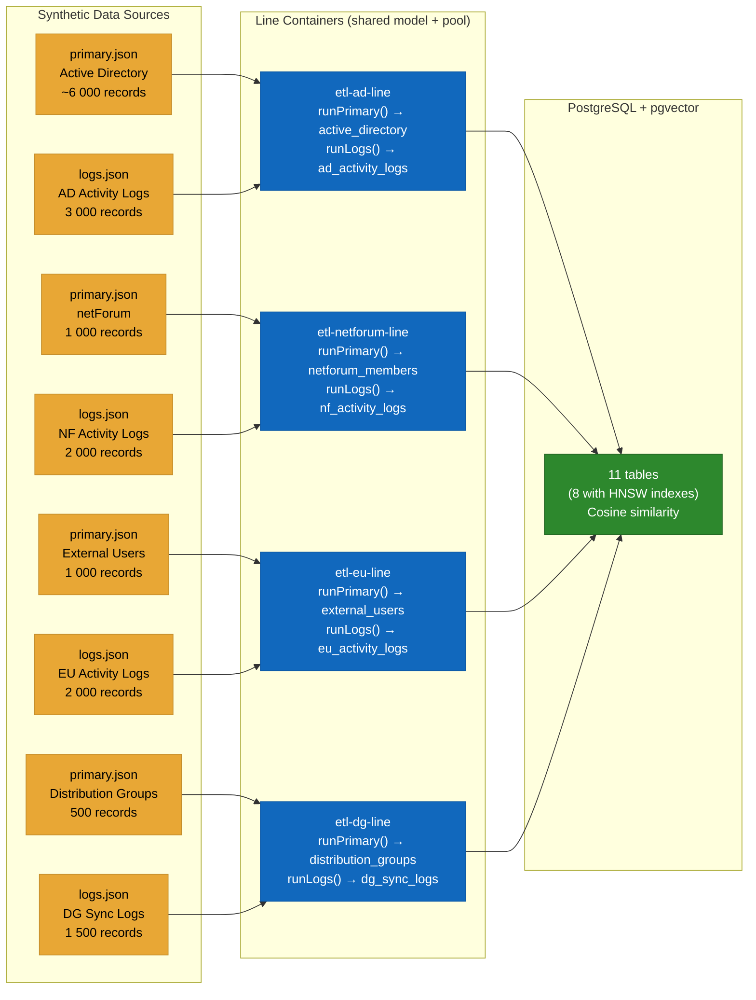

# ETL Data Flow

```mermaid
flowchart LR
    classDef source fill:#E8A735,stroke:#C48E2C,color:#000
    classDef process fill:#1168BD,stroke:#0E5BA7,color:#fff
    classDef store fill:#2D882D,stroke:#226622,color:#fff

    subgraph Sources [" Synthetic Data Sources "]
        P1["primary.json\nActive Directory\n~6 000 records"]:::source
        P2["primary.json\nnetForum\n1 000 records"]:::source
        P3["primary.json\nExternal Users\n1 000 records"]:::source
        P4["primary.json\nDistribution Groups\n500 records"]:::source
        L1["logs.json\nAD Activity Logs\n3 000 records"]:::source
        L2["logs.json\nNF Activity Logs\n2 000 records"]:::source
        L3["logs.json\nEU Activity Logs\n2 000 records"]:::source
        L4["logs.json\nDG Sync Logs\n1 500 records"]:::source
    end

    subgraph Lines [" Line Containers (shared model + pool) "]
        C1["etl-ad-line\nrunPrimary() → active_directory\nrunLogs() → ad_activity_logs"]:::process
        C2["etl-netforum-line\nrunPrimary() → netforum_members\nrunLogs() → nf_activity_logs"]:::process
        C3["etl-eu-line\nrunPrimary() → external_users\nrunLogs() → eu_activity_logs"]:::process
        C4["etl-dg-line\nrunPrimary() → distribution_groups\nrunLogs() → dg_sync_logs"]:::process
    end

    subgraph Database [" PostgreSQL + pgvector "]
        DB["11 tables\n(8 with HNSW indexes)\nCosine similarity"]:::store
    end

    P1 & L1 --> C1 --> DB
    P2 & L2 --> C2 --> DB
    P3 & L3 --> C3 --> DB
    P4 & L4 --> C4 --> DB
```
