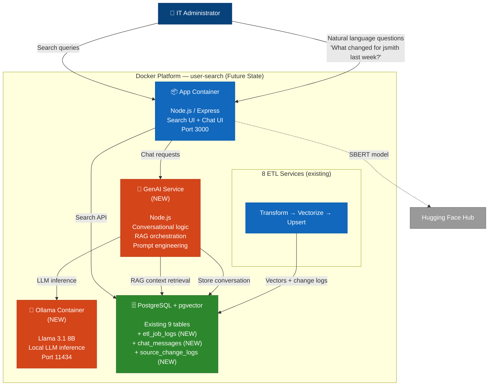

# GenAI Expansion — Target Architecture (C4 Container)

> Per `docs/genai_expansion_plan.md` — this is the planned future state.

```mermaid
graph TB
    classDef person fill:#08427B,stroke:#073B6F,color:#fff
    classDef existing fill:#1168BD,stroke:#0E5BA7,color:#fff
    classDef new fill:#D4451A,stroke:#B83A15,color:#fff
    classDef database fill:#2D882D,stroke:#226622,color:#fff
    classDef external fill:#999999,stroke:#6B6B6B,color:#fff

    User["👤 IT Administrator"]:::person

    subgraph DockerPlatform [" Docker Platform — user-search (Future State) "]
        direction TB

        App["📦 App Container<br/><br/>Node.js / Express<br/>Search UI + Chat UI<br/>Port 3000"]:::existing

        GenAI["🤖 GenAI Service<br/>(NEW)<br/><br/>Node.js<br/>Conversational logic<br/>RAG orchestration<br/>Prompt engineering"]:::new

        Ollama["🧠 Ollama Container<br/>(NEW)<br/><br/>Llama 3.1 8B<br/>Local LLM inference<br/>Port 11434"]:::new

        Postgres["🗄️ PostgreSQL + pgvector<br/><br/>Existing 9 tables<br/>+ etl_job_logs (NEW)<br/>+ chat_messages (NEW)<br/>+ source_change_logs (NEW)"]:::database

        subgraph ETLServices [" 8 ETL Services (existing) "]
            ETL["Transform → Vectorize → Upsert"]:::existing
        end
    end

    HF["Hugging Face Hub"]:::external

    User -->|"Search queries"| App
    User -->|"Natural language questions<br/>'What changed for jsmith last week?'"| App
    App -->|"Search API"| Postgres
    App -->|"Chat requests"| GenAI
    GenAI -->|"RAG context retrieval"| Postgres
    GenAI -->|"LLM inference"| Ollama
    GenAI -->|"Store conversation"| Postgres
    ETL -->|"Vectors + change logs"| Postgres
    App -.->|"SBERT model"| HF
```
