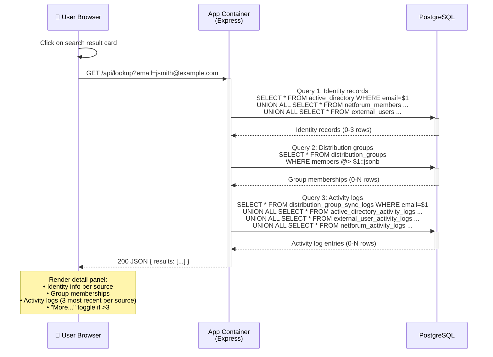

# User Lookup / Detail Panel Sequence

```mermaid
sequenceDiagram
    participant U as 👤 User Browser
    participant A as App Container<br/>(Express)
    participant P as PostgreSQL

    U->>U: Click on search result card

    U->>+A: GET /api/lookup?email=jsmith@example.com

    A->>+P: Query 1: Identity records<br/>SELECT * FROM active_directory WHERE email=$1<br/>UNION ALL SELECT * FROM netforum_members ...<br/>UNION ALL SELECT * FROM external_users ...
    P-->>-A: Identity records (0-3 rows)

    A->>+P: Query 2: Distribution groups<br/>SELECT * FROM distribution_groups<br/>WHERE members @> $1::jsonb
    P-->>-A: Group memberships (0-N rows)

    A->>+P: Query 3: Activity logs<br/>SELECT * FROM distribution_group_sync_logs WHERE email=$1<br/>UNION ALL SELECT * FROM active_directory_activity_logs ...<br/>UNION ALL SELECT * FROM external_user_activity_logs ...<br/>UNION ALL SELECT * FROM netforum_activity_logs ...
    P-->>-A: Activity log entries (0-N rows)

    A-->>-U: 200 JSON { results: [...] }

    Note over U: Render detail panel:<br/>• Identity info per source<br/>• Group memberships<br/>• Activity logs (3 most recent per source)<br/>• "More..." toggle if >3
```
