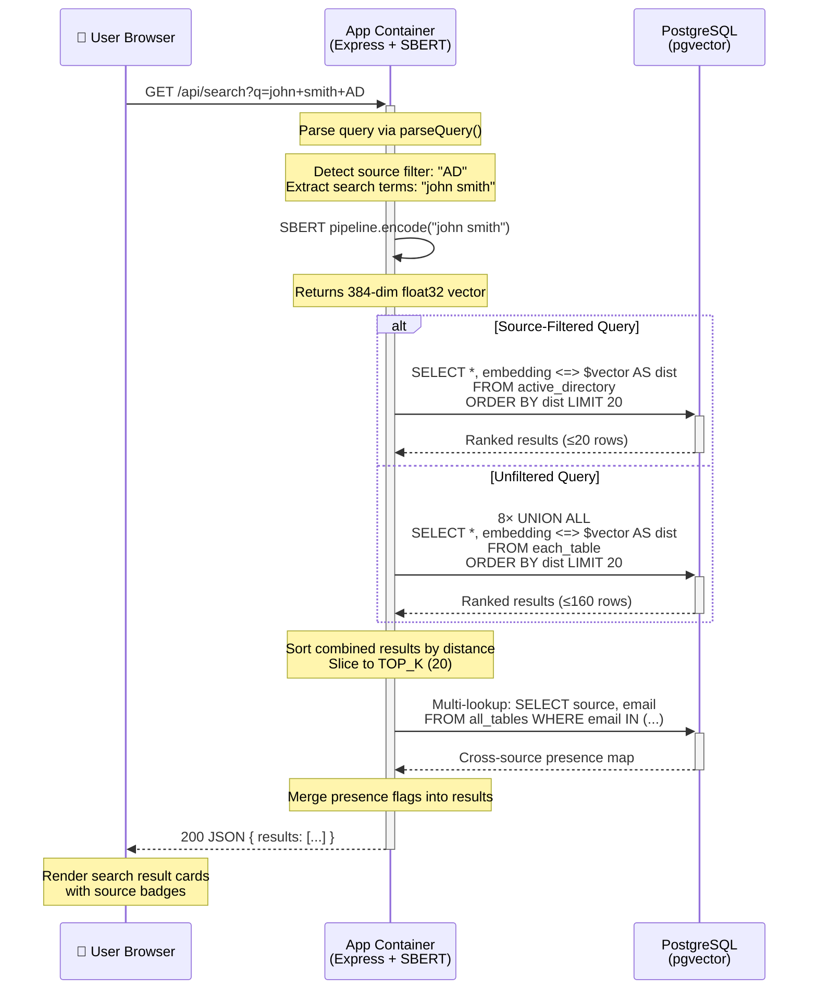

# Search Request Sequence

```mermaid
sequenceDiagram
    participant U as 👤 User Browser
    participant A as App Container<br/>(Express + SBERT)
    participant P as PostgreSQL<br/>(pgvector)

    U->>+A: GET /api/search?q=john+smith+AD

    Note over A: Parse query via parseQuery()
    Note over A: Detect source filter: "AD"<br/>Extract search terms: "john smith"

    A->>A: SBERT pipeline.encode("john smith")
    Note over A: Returns 384-dim float32 vector

    alt Source-Filtered Query
        A->>+P: SELECT *, embedding <=> $vector AS dist<br/>FROM active_directory<br/>ORDER BY dist LIMIT 20
        P-->>-A: Ranked results (≤20 rows)
    else Unfiltered Query
        A->>+P: 8× UNION ALL<br/>SELECT *, embedding <=> $vector AS dist<br/>FROM each_table<br/>ORDER BY dist LIMIT 20
        P-->>-A: Ranked results (≤160 rows)
    end

    Note over A: Sort combined results by distance<br/>Slice to TOP_K (20)

    A->>+P: Multi-lookup: SELECT source, email<br/>FROM all_tables WHERE email IN (...)
    P-->>-A: Cross-source presence map

    Note over A: Merge presence flags into results

    A-->>-U: 200 JSON { results: [...] }

    Note over U: Render search result cards<br/>with source badges
```
