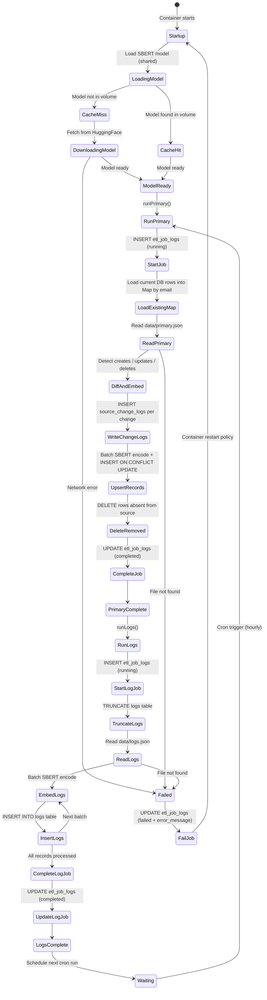

# ETL Job State Diagram

```mermaid
stateDiagram-v2
    [*] --> Startup: Container starts

    Startup --> LoadingModel: Load SBERT model (shared)

    LoadingModel --> CacheMiss: Model not in volume
    LoadingModel --> CacheHit: Model found in volume

    CacheMiss --> DownloadingModel: Fetch from HuggingFace
    DownloadingModel --> ModelReady: Model ready
    DownloadingModel --> Failed: Network error

    CacheHit --> ModelReady: Model ready

    ModelReady --> RunPrimary: runPrimary()

    RunPrimary --> StartJob: INSERT etl_job_logs (running)
    StartJob --> LoadExistingMap: Load current DB rows into Map by email
    LoadExistingMap --> ReadPrimary: Read data/primary.json
    ReadPrimary --> Failed: File not found
    ReadPrimary --> DiffAndEmbed: Detect creates / updates / deletes

    DiffAndEmbed --> WriteChangeLogs: INSERT source_change_logs per change
    WriteChangeLogs --> UpsertRecords: Batch SBERT encode + INSERT ON CONFLICT UPDATE
    UpsertRecords --> DeleteRemoved: DELETE rows absent from source
    DeleteRemoved --> CompleteJob: UPDATE etl_job_logs (completed)
    CompleteJob --> PrimaryComplete

    PrimaryComplete --> RunLogs: runLogs()

    RunLogs --> StartLogJob: INSERT etl_job_logs (running)
    StartLogJob --> TruncateLogs: TRUNCATE logs table
    TruncateLogs --> ReadLogs: Read data/logs.json
    ReadLogs --> Failed: File not found
    ReadLogs --> EmbedLogs: Batch SBERT encode
    EmbedLogs --> InsertLogs: INSERT INTO logs table
    InsertLogs --> EmbedLogs: Next batch
    InsertLogs --> CompleteLogJob: All records processed
    CompleteLogJob --> UpdateLogJob: UPDATE etl_job_logs (completed)
    UpdateLogJob --> LogsComplete

    LogsComplete --> Waiting: Schedule next cron run
    Waiting --> RunPrimary: Cron trigger (hourly)

    Failed --> FailJob: UPDATE etl_job_logs (failed + error_message)
    FailJob --> Startup: Container restart policy
```
