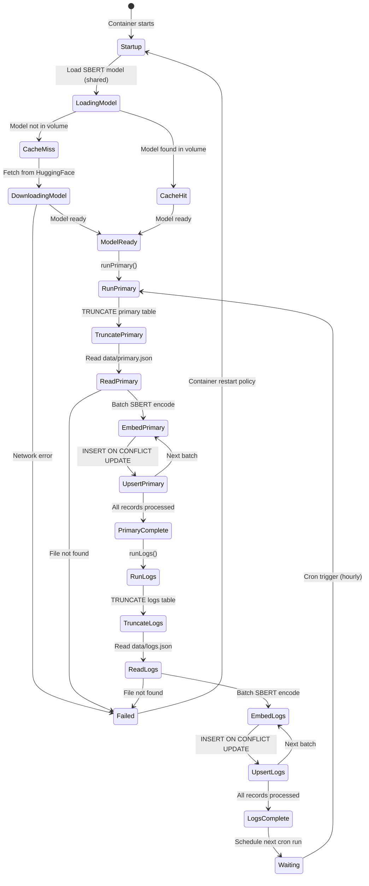

# ETL Job State Diagram

```mermaid
stateDiagram-v2
    [*] --> Startup: Container starts

    Startup --> LoadingModel: Load SBERT model (shared)

    LoadingModel --> CacheMiss: Model not in volume
    LoadingModel --> CacheHit: Model found in volume

    CacheMiss --> DownloadingModel: Fetch from HuggingFace
    DownloadingModel --> ModelReady: Model ready
    DownloadingModel --> Failed: Network error

    CacheHit --> ModelReady: Model ready

    ModelReady --> RunPrimary: runPrimary()

    RunPrimary --> TruncatePrimary: TRUNCATE primary table
    TruncatePrimary --> ReadPrimary: Read data/primary.json
    ReadPrimary --> Failed: File not found
    ReadPrimary --> EmbedPrimary: Batch SBERT encode
    EmbedPrimary --> UpsertPrimary: INSERT ON CONFLICT UPDATE
    UpsertPrimary --> EmbedPrimary: Next batch
    UpsertPrimary --> PrimaryComplete: All records processed

    PrimaryComplete --> RunLogs: runLogs()

    RunLogs --> TruncateLogs: TRUNCATE logs table
    TruncateLogs --> ReadLogs: Read data/logs.json
    ReadLogs --> Failed: File not found
    ReadLogs --> EmbedLogs: Batch SBERT encode
    EmbedLogs --> UpsertLogs: INSERT ON CONFLICT UPDATE
    UpsertLogs --> EmbedLogs: Next batch
    UpsertLogs --> LogsComplete: All records processed

    LogsComplete --> Waiting: Schedule next cron run
    Waiting --> RunPrimary: Cron trigger (hourly)

    Failed --> Startup: Container restart policy
```
